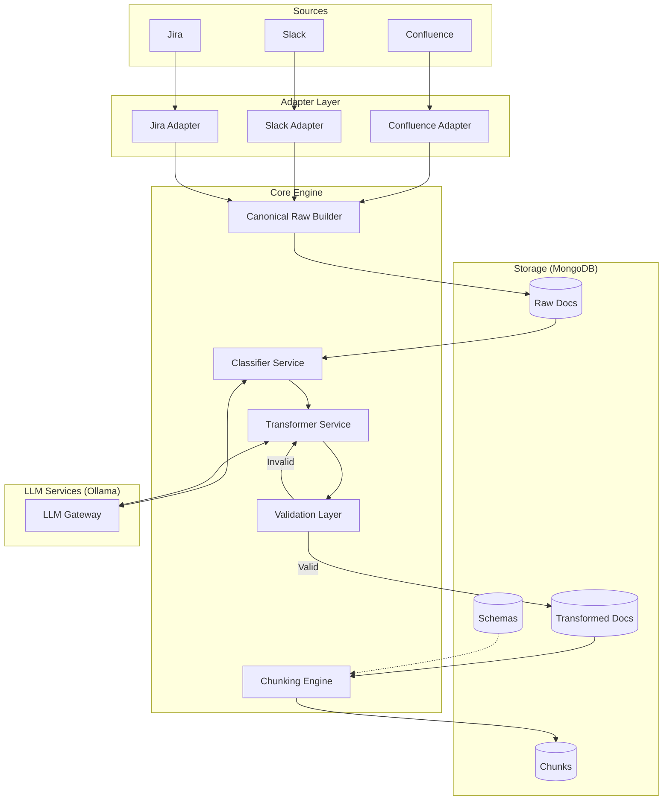

# Knowledge Normalization Engine Architecture Design

## 1. Executive Summary

This document outlines the architecture for evolving the Confluence ingestion pipeline into a source-agnostic Knowledge Normalization Engine. The system normalizes diverse inputs (Confluence, Slack, Jira) into a canonical format, classifies them into strict schemas, transforms them using local LLMs, validates the output rigorously, and chunks it deterministically for downstream RAG applications.

### Key Constraints & Decisions
- **Source Agnostic:** All sources map to `Canonical Raw Document` before processing.
- **Strict Schemas:** No dynamic schema generation. All documents must fit predefined types (`runbook_v1`, `incident_ticket_v1`, etc.).
- **Local Control:** LLM (Ollama) and Embedding models are fully configurable and swappable.
- **Deterministic:** Chunking and ID generation are pure functions of the content and schema rules, ensuring stability.
- **Idempotency:** The pipeline can be re-run safely; hashes ensure we skip unchanged work.

---

## 2. System Architecture

The system follows a **Pipeline/Filter** pattern with a strict separation of concerns.

### High-Level Data Flow



### Component Breakdown

1.  **Source Adapters (`adapters/`)**:
    -   Fetch data from external APIs.
    -   Convert source-specific payloads (ADF, JSON block kit) into `Canonical Raw Format`.
    -   **Constraint**: Must strictly output the defined `Canonical Raw Document` structure.

2.  **Canonical Raw Builder**:
    -   Central entry point.
    -   Assigns `source_id` and `source_type`.
    -   Computes `content_hash` of the raw content for idempotency.

3.  **Classifier Service (`services/classifier.py`)**:
    -   Input: Raw text/content.
    -   Output: `schema_id` (selected from `schemas` collection).
    -   Mechanism: Zero-shot classification via LLM, constrained to valid `schema_id` list.

4.  **Transformer Service (`services/transformer.py`)**:
    -   Input: Raw Document + Target Schema.
    -   Output: JSON matching the target schema.
    -   Mechanism: LLM with schema-specific prompt.

5.  **Validation Layer (`services/validator.py`)**:
    -   Strict `pydantic` or `jsonschema` validation.
    -   Checks `additionalProperties: false`.
    -   Enforces `unmapped_content` field presence.

6.  **Chunking Engine (`services/chunker.py`)**:
    -   **Pure Python implementation (No LLM).**
    -   Loads `chunking_rules` from the Schema definition.
    -   Splits text based on rules (e.g., "split by `##` headers for runbooks").
    -   Generates deterministic `chunk_id`.

---

## 3. Data Models (MongoDB)

### Collection: `schemas`
*Defines the valid target states.*
```json
{
  "_id": "runbook_v1",
  "description": "Standard engineering runbook",
  "system_prompt_template": "You are a technical writer...",
  "json_schema": {
    "type": "object",
    "required": ["title", "prerequisites", "steps", "unmapped_content"],
    "additionalProperties": false,
    "properties": { ... }
  },
  "chunking_rules": {
    "strategy": "hierarchical",
    "split_on": ["steps"],
    "min_chunk_size": 100
  },
  "version": 1
}
```

### Collection: `raw_documents`
*The source of truth for ingestion.*
```json
{
  "_id": "confluence_12345",
  "source": "confluence",
  "source_id": "123456",
  "source_metadata": { "space": "ENG", "url": "..." },
  "content_hash": "sha256_hash_of_raw_content",
  "canonical_data": {
    "title": "Database Migration Guide",
    "author": "jane.doe",
    "created_at": "2023-10-27T10:00:00Z",
    "content_blocks": [
       { "type": "paragraph", "text": "..." }
    ]
  },
  "ingested_at": "2023-10-27T10:05:00Z"
}
```

### Collection: `transformed_documents`
*The normalized, strictly structured data.*
```json
{
  "_id": "confluence_12345_runbook_v1",
  "raw_doc_id": "confluence_12345",
  "schema_id": "runbook_v1",
  "schema_version": 1,
  "transform_model": "llama3:8b",
  "transform_prompt_version": "v2",
  "transform_hash": "sha256_hash_of_content_plus_prompt_plus_model",
  "content": {
    "title": "Database Migration Guide",
    "prerequisites": ["Access to Prod", "DB Backup"],
    "steps": [...],
    "unmapped_content": ""
  },
  "is_valid": true,
  "created_at": "..."
}
```

### Collection: `chunks`
*The embedding-ready units.*
```json
{
  "_id": "chunk_sha256_deterministic_id",
  "doc_id": "confluence_12345_runbook_v1",
  "schema_id": "runbook_v1",
  "section_path": "steps[2]",
  "text": "Step 3: Run the migration script...",
  "metadata": {
    "source": "confluence",
    "title": "Database Migration Guide",
    "author": "jane.doe"
  },
  "embedding_model": "nomic-embed-text",
  "embedding_hash": "sha256_of_text_and_model_config",
  "created_at": "..."
}
```
*(Embeddings are stored in a separate vector store or `embedding` field if using Mongo Vector Search, but managed separately).*

---

## 4. Folder Structure (Python Async)
```text
src/
├── adapters/               # Source Adapters
│   ├── base.py             # Abstract Base Class
│   ├── confluence.py
│   ├── slack.py
│   └── jira.py
├── core/
│   ├── config.py           # Pydantic Settings
│   ├── db.py               # Motor Storage Class
│   └── llm.py              # Ollama Client Wrapper
├── services/
│   ├── classifier.py       # Raw -> Schema ID
│   ├── transformer.py      # Raw -> JSON
│   ├── validator.py        # JSON Schema Enforcement
│   └── chunker.py          # JSON -> Chunks (Deterministic)
├── orchestration/
│   ├── pipeline.py         # Main Async Workflow
│   └── retry.py            # Retry Decorators/Logic
├── storage/
│   └── mongo.py            # Collection Wrappers
├── utils/
│   ├── hashing.py          # Consistent hashing utils
│   └── text.py             # Text cleaning utils
└── main.py                 # Entry point
```

---

## 5. Configuration Strategy

We use `pydantic-settings` for type-safe configuration.

### `core/config.py`

```python
from pydantic_settings import BaseSettings

class Settings(BaseSettings):
    # Infrastructure
    MONGO_URI: str
    MONGO_DB_NAME: str = "knowledge_engine"
    
    # LLM (Ollama)
    OLLAMA_BASE_URL: str = "http://localhost:11434"
    OLLAMA_TRANSFORM_MODEL: str = "llama3:8b"     # Configurable model
    OLLAMA_EMBEDDING_MODEL: str = "nomic-embed-text"
    
    # Pipeline Control
    MAX_CONCURRENCY: int = 5
    ENABLE_DEBUG_LOGS: bool = False
    
    # Sources
    CONFLUENCE_URL: str | None = None
    CONFLUENCE_API_TOKEN: str | None = None
    # ... other source creds

    model_config = {"env_file": ".env"}

settings = Settings()
```

---

## 6. Prevention Strategies (The "How-To")

### A. Preventing Schema Explosion
*Problem: Creating a new schema for every minor document variation.*
**Strategy:**
1.  **Generic Fallback:** Always have a `general_doc_v1` schema that is essentially `{"title": str, "sections": List[str]}`.
2.  **Strict Review:** Schemas are code. They live in the codebase (or a controlled Mongo collection seeded from code). Adding a schema requires a PR.
3.  **Semantic, Not Visual:** Schemas describe *what* the document is (e.g., "Incident Report"), not *how* it looked (e.g., "Table Layout").

### B. Preventing LLM Hallucination
*Problem: LLM invents fields or data not in the source.*
**Strategy:**
1.  **Strict Schema Injection:** The prompt MUST include the JSON Schema.
2.  **`unmapped_content` Field:** Force the LLM to dump anything it can't fit into the strict schema into complete string bucket (`unmapped_content`). This reduces the pressure to "invent" places for orphaned text.
3.  **Validation Loop:** If `validator.py` fails (unexpected field), the error is fed back to the LLM for **one** retry. If it fails again, the document falls back to `general_doc_v1`.

### C. Preventing Source-Specific Schema Drift
*Problem: A "Jira Ticket" schema starts looking like a "Jira JSON dump".*
**Strategy:**
1.  **Adapter Isolation:** The `Transformer` never sees the raw API response. It *only* sees the `Canonical Raw Document`.
2.  **Fields Ban:** Explicitly ban source-specific metadata (e.g., `jira_custom_field_123`) from the Target Schemas. Metadata stays in `source_metadata`.

### D. Preventing Non-Deterministic Chunking
*Problem: Re-running the pipeline generates different chunks, thrashing the vector store.*
**Strategy:**
1.  **No LLMs in Chunking:** Chunking logic must be code (Python), not AI.
2.  **Stable IDs:** `chunk_id` = `sha256(schema_id + section_path + content)`.
3.  **Content-Based Boundaries:** Split on explicit markers defined in schema (e.g., Markdown headers, list items), never on "semantic meaning" which is fuzzy.

---

## 7. Implementation Plan

1.  **Setup:** Initialize `Settings`, `MongoStorage`, and `OllamaClient`.
2.  **Schema Seeding:** Create a script to upsert default schemas (`general_doc_v1`, `runbook_v1`) into MongoDB.
3.  **Adapters:** Implement `ConfluenceAdapter` returning `CanonicalRawDocument`.
4.  **Pipeline Core:** Implement `Classifier` -> `Transformer` -> `Validator`.
5.  **Chunking:** Implement rule-based chunker.
6.  **Orchestrator:** Tie it together with idempotency checks (skip if `transform_hash` matches).
